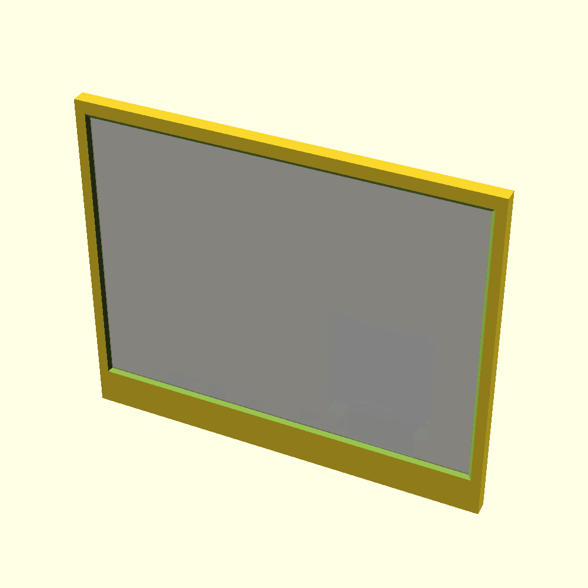

Frame for e-ink Screen
======================

The frame for [10.3inch e-Paper e-Ink Display HAT For Raspberry Pi](https://www.waveshare.com/product/displays/e-paper/epaper-1/10.3inch-e-paper-hat.htm).

The Frame is done as two pieces:

The front panel, and the back panel. Also, it requires 6 bolts and 2 nuts M3 (4 bolts to fixate the HAT in the box, 
and 2 bolts with nuts to connect the panels)

